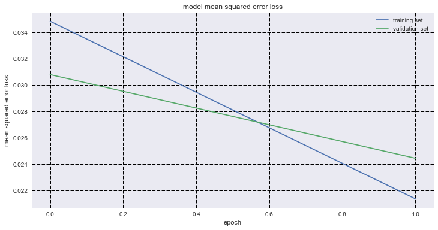

# Behavioral-Cloning

## Michael DeFilippo

#### Please see my [project code](https://github.com/mikedef/Behavioral-Cloning/blob/master/behavioral-cloning-submission/model.py) for any questions regarding implimentation.

## Project Goals:
  1. Develop a NN in Keras that can predict stearing angles from images
  2. Use a simulator to collect and store images and associated steering angles to train the NN on.
  3. Train and validate the model in Keras
  4. Autonomously drive around the track without leaving the road or hitting the sides of the track.
  
### Data Gathering 
Udacity provided a training simulator that collects images from 3 cameras mounted on a vehicle at the left, right, and center. I first gathered my own data based on following the progression of the lesson and the recomendations of the lecturer. After much frustration with not sucessfully training a network to drive a vehicle in the simulator autonomusly, I look up many forum questions and found that the simulator is flawed when using a keyboard. After much time I decided to train my network using the provided dataset from the project.

  
### Data Set Summary & and Preparation
#### Simulator Images
First lets look at a subset of randomly selected data from the center camera as shown below.

It is easy to see that there are many pixels in the image that will not provide any useful information to the NN, such as the hood of the car or anything above the horizon line. 

Cropping off the bottom 20 pixels and the top 50 pixels show that this is a much more useful image. This will also cuts down on the amount of pixels to process in each image. 

Lets also look at a corrolated set of images from the left, center, and right cameras of the vehicle.

#### Metadata
The dataset shows that most of the steering angles are close to zero, which indicates mostely straight driving. 

#### Augmentation Techniques
Augmenting the dataset is a technique to increase the amount of data available to train the network. Since the provided images were limited and I could not collect any extra data due to a lack of a video game control, I decided to augment the images. 
Below is an image from the center camera of the vehicle. 

Next I can use the left and right camera images to simulate driving the effect of a car wandering off to the side, and recovering. I added an angle of 0.25 to the left camera and subtracted 0.25 from the right camera. This way I simulated that the left and right camera are actually in the center of the vehicle.

Next I flipped the images horizontally. It is easy to see looking at the layout of the simulation track and the associated steering angles that the track is full of mostly left turns. To simulate right turns I flipped the image horizontally and inverted the steering angle.

Next I explored adding in a brightness adjustment. I did not actually use this to train my model since I had enough data after training with the previous augmented data to autonomously navigate the track. Here is a sample below of what a brightness augmented image would look like to simulate driving in different lighting conditions.

### Building the Model

After going through the project lessons and working though the problems, I focused on building the NVIDIA model architecture. I based this off of reading that NVIDIA used this in the real world, as well as recomendations in the classroom. 

| Layer         		|     Description	        					| 
|:---------------------:|:---------------------------------------------:| 
| Input         		| 160x320x3 RGB Image				| 
| Cropping          | output 90x320x3        |
| Convolution 5x5     	| 2x2 stride, valid padding, output 43x158x24 	|
| ELU					| Activation									|
| Convolution 5x5	    | 2x2 stride, valid padding, outputs 20x77x36	|
| ELU					| Activation									|
| Covolution 5x5	| 2x2 stride, valid padding, outputs 8x37x48       				|
| ELU					| Activation									|
| Convolution 5x5	    | 2x2 stride, valid padding, outputs 6x37x48	|
| ELU					| Activation									|
| Covolution 5x5	| 2x2 stride, valid padding, outputs 4x33x64       				|
| ELU					| Activation									|
| Dropout				| keep_prob = 0.5 								|
| Flatten		|  |
| Dense     | Input = 8848. Output = 100       				|
| Dense     | Input = 100. Output = 50       				|
| Dense     | Input = 50. Output = 10       				|
| Dense     | Input = 10. Output = 1       				|
|						|												|
|						|												|

### Autonomous Driving 
Link in Video

